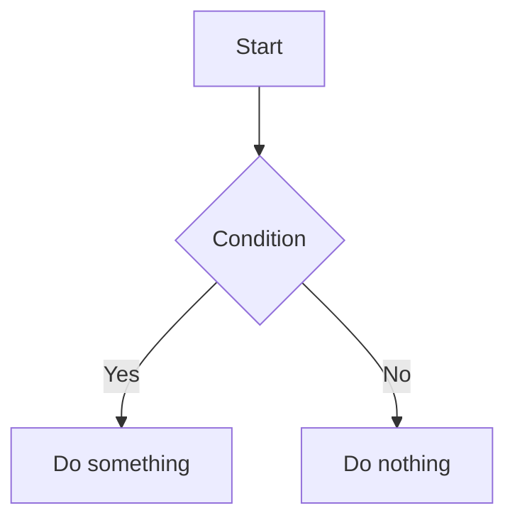

# MarkFlow

MarkFlow — Online Markdown Editor with Mermaid diagrams and LaTeX support. Export to PDF, HTML, live preview, and clean UI.

## Features

- **Live preview** — real-time rendered output as you type
- **Mermaid diagrams** — render flowcharts, sequence diagrams, and more
- **LaTeX math** — inline and block equations via KaTeX
- **Syntax highlighting** — code blocks with highlight.js
- **Export to PDF** — save your document as a PDF file
- **Export to HTML** — export as a standalone HTML page
- **Monaco editor** — VS Code-like editing experience
- **GitHub Flavored Markdown** — tables, task lists, strikethrough, etc.

## Tech Stack

- [Vue 3](https://vuejs.org/)
- [Vite](https://vitejs.dev/)
- [Monaco Editor](https://microsoft.github.io/monaco-editor/)
- [Mermaid](https://mermaid.js.org/)
- [KaTeX](https://katex.org/)
- [unified](https://unifiedjs.com/) (remark + rehype pipeline)

## Getting Started

```bash
# Install dependencies
npm install

# Start dev server
npm run dev

# Build for production
npm run build
```

## Usage

1. Type Markdown in the left editor panel.
2. See the rendered preview on the right in real time.
3. Use the toolbar to export as **PDF** or **HTML**.

### LaTeX example

```
Inline: $E = mc^2$

Block:
$$
\int_0^\infty e^{-x^2} dx = \frac{\sqrt{\pi}}{2}
$$
```

### Mermaid example

````

````
